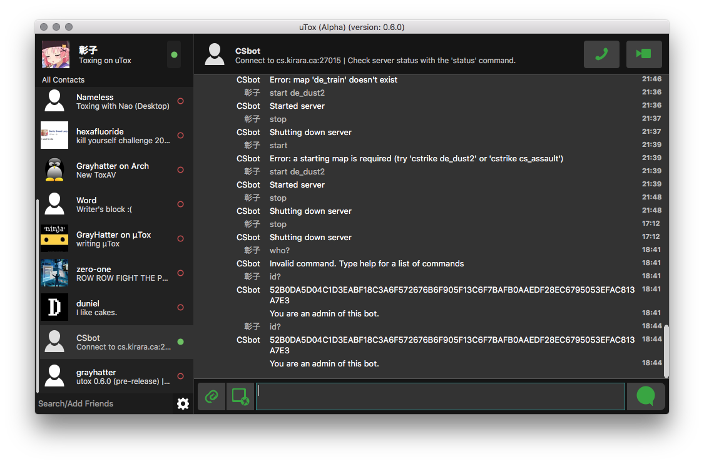

# μTox     

The lightweight [Tox](https://github.com/TokTok/toxcore) client.

[**Tox Project Website**](https://tox.chat) **|** [**Tox Project Wiki**](https://wiki.tox.chat/) **|** [**Installing**](docs/INSTALL.md) **|** [**Changelog**](CHANGELOG.md) **|** [**Compiling**](docs/BUILD.md) **|** [**Toxcore Spec**](https://toktok.github.io/spec).

You shouldn't have to choose a new client for every device: So µTox works everywhere! On every major system **Windows**, **OSX**, **Linux**, and even **Android**.

### Downloads
* **Windows**
 * [32bit Version](https://build.tox.chat/view/uTox/job/uTox_build_windows_x86_debug/lastSuccessfulBuild/artifact/utox_windows_x86_debug.zip)
 * [64bit Version](https://build.tox.chat/view/uTox/job/uTox_build_windows_x86-64_release/lastSuccessfulBuild/artifact/utox_windows_x86-64.zip)
 * [Windows XP Version](https://build.tox.chat/job/uTox-nightly-FOR-WIN-XP_build_windows_x86_debug/lastSuccessfulBuild/artifact/utox_nightly.zip)
* **Linux/Posix**
 * [static x64](https://build.tox.chat/view/uTox/job/uTox_build_linux_x86-64_release/lastSuccessfulBuild/artifact/utox_linux_x86-64.tar.xz)
 * [static x32](https://build.tox.chat/view/uTox/job/uTox_build_linux_x86_release/lastSuccessfulBuild/artifact/utox_linux_x86.tar.xz)
* **OSX**
 * [Last Updated .dmg](https://github.com/GrayHatter/uTox/releases/download/v0.8.1/uTox-0.8.1.dmg) -- *could be out of date*
 * [Version List](https://github.com/GrayHatter/uTox/releases)
* **Android**
 * [uTox Android on Google Play](https://play.google.com/apps/testing/tox.client.utox)
 * [Direct apk](https://build.tox.chat/view/uTox/job/uTox_build_android_armhf_release/lastSuccessfulBuild/artifact/uTox.apk) (You may need to uninstall the previous version.)

### Features
- Avatars
- Secure person to person conversations:
  - Video (Webcam or Desktop sharing)
  - Audio
  - Text
    - Chat History
  - Screenshots
- Group chats
  - New API support ready.
- File transfers, with inline images support
- Tox DNS support with [uTox.org](http://register.utox.org/)
- Tox URI support (clickable Tox links)
- Emoticons
- Auto-updates on Windows.

Just like Toxcore, µTox is still alpha software, so you may encounter bugs, or maybe a crash or two. µTox also needs your help, if you do encounter any bugs or problems please open an issue.

### Screenshots
μTox running on Windows 10

μTox running on OSX:

μTox running on Linux (Ubuntu)

")
